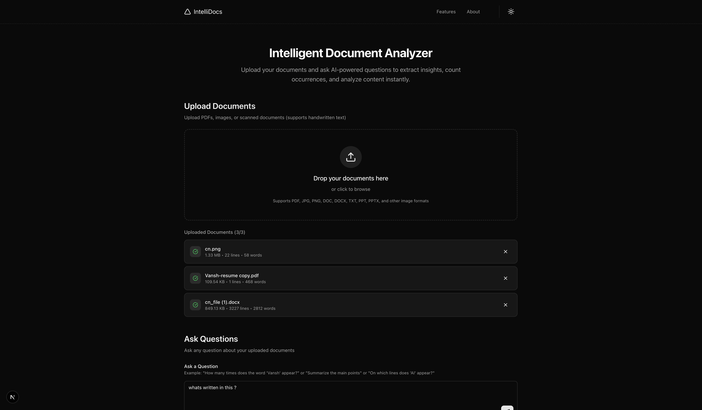
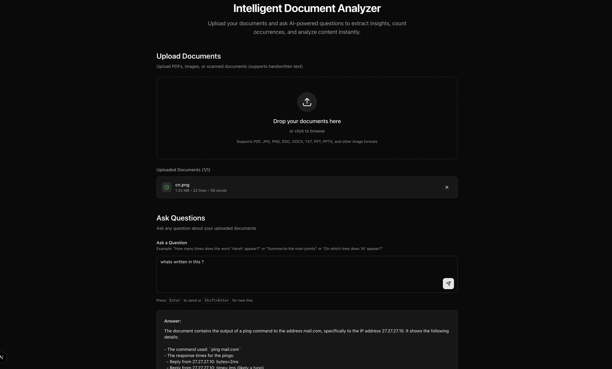
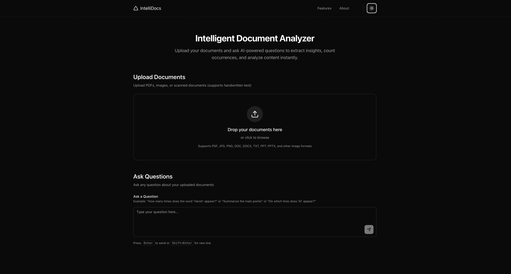

# IntelliDocs

**IntelliDocs** is an AI-powered intelligent document analyzer that allows you to upload various document types (PDFs, images, DOCX, TXT) and ask natural language questions about their content. The application uses advanced OCR technology for scanned documents and leverages AI to provide accurate answers about document content, word counts, line locations, and summaries.



<div align="center">
  
  
</div>

## Features

- **Multi-Format Support**: Upload PDFs, images (JPG, PNG, GIF, BMP, WEBP), DOCX, TXT, PPT, and PPTX files
- **Serverless OCR**: Extract text from scanned PDFs and images using **Tesseract.js** (WASM-based, no system dependencies)
- **AI-Powered Analysis**: Ask natural language questions about your documents using GPT-4o-mini
- **Cloud Storage**: Secure file storage and metadata management using **Supabase**
- **Intelligent Text Extraction**: 
  - Native PDF text extraction with OCR fallback
  - DOCX text extraction using Mammoth
  - Image-to-text conversion
- **Advanced Queries**: 
  - Count word occurrences
  - Find specific line numbers
  - Summarize content
- **Modern UI**: Beautiful, responsive interface built with React, TailwindCSS, and Shadcn UI

## Tech Stack

### Frontend
- **[Next.js 15](https://nextjs.org/)** - React framework with App Router
- **[React 19](https://react.dev/)** - UI library
- **[TypeScript](https://www.typescriptlang.org/)** - Type-safe JavaScript
- **[TailwindCSS 4](https://tailwindcss.com/)** - Utility-first CSS framework
- **[Shadcn UI](https://ui.shadcn.com/)** - Reusable components

### Backend & Services
- **[Supabase](https://supabase.com/)** - PostgreSQL Database & File Storage
- **[Next.js API Routes](https://nextjs.org/docs/api-routes/introduction)** - Serverless API endpoints
- **[OpenAI API](https://openai.com/)** - AI-powered document analysis (via GitHub Models)

### Document Processing
- **[Tesseract.js](https://github.com/naptha/tesseract.js)** - WebAssembly OCR (Serverless compatible)
- **[unpdf](https://www.npmjs.com/package/unpdf)** - PDF text extraction
- **[mammoth](https://www.npmjs.com/package/mammoth)** - DOCX to text conversion

## Prerequisites

Before running this project, ensure you have:

1. **Node.js** (v20 or higher)
2. **Supabase Account** (for database and storage)
3. **GitHub Account** (for AI models access)

## Installation & Setup

### 1. Clone the Repository
```bash
git clone <repository-url>
cd intelli-docs
```

### 2. Install Dependencies
```bash
npm install
```

### 3. Configure Supabase
1. Create a new project at [database.new](https://database.new).
2. Run the following SQL in the Supabase SQL Editor to set up the schema:

```sql
-- Create documents table
create table if not exists documents (
  id uuid default gen_random_uuid() primary key,
  original_name text not null,
  storage_path text not null,
  extracted_text text,
  file_type text,
  file_size bigint,
  lines_count int,
  word_count int,
  created_at timestamp with time zone default timezone('utc'::text, now()) not null
);

-- Create storage bucket
insert into storage.buckets (id, name, public) 
values ('documents', 'documents', true)
on conflict (id) do nothing;

-- Set security policies
create policy "Public Access" on storage.objects for select using ( bucket_id = 'documents' );
create policy "Public Upload" on storage.objects for insert with check ( bucket_id = 'documents' );
```

### 4. Configure Environment Variables
Create a `.env.local` file in the root directory:

```env
# GitHub Token for AI Models (Required)
GITHUB_TOKEN=your_github_personal_access_token

# Supabase Configuration (Required)
NEXT_PUBLIC_SUPABASE_URL=your_supabase_project_url
NEXT_PUBLIC_SUPABASE_ANON_KEY=your_supabase_anon_key
```

### 5. Run Development Server
```bash
npm run dev
```

Open [http://localhost:3000](http://localhost:3000) in your browser.

## Deployment

### Live Demo
**[View Live Demo](https://intellidocsai.vercel.app)**


## License

This project is open source and available under the MIT License.
